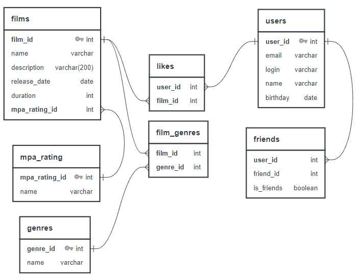

# java-filmorate
**Схема базы данных:**

**Примеры запросов к БД:**

*получение всех пользователей:* 
* SELECT *
* FROM users

*получение пользователя по 'id':* 
* SELECT * 
* FROM users 
* WHERE user_id='id'

*получение списка общих друзей пользователя 'id' с другим пользователем 'otherId':*
* SELECT *
* FROM users
* WHERE user_id
* IN (SELECT friend_id FROM friends WHERE user_id='id' AND is_friends=1)
* AND user_id
* IN (SELECT friend_id FROM friends WHERE user_id='otherId' AND is_friends=1)

*получение всех фильмов:* 
* SELECT * 
* FROM films;

*получение фильма по 'id':* 
* SELECT * 
* FROM films
* WHERE film_id='id';

*получение топ N наиболее популярных фильмов:* 
* SELECT  film_id, name, description, release_date, duration, mpa_rating_id, COUNT(likes.film_id) as all_likes
* FROM films
* LEFT JOIN likes ON films.film_id=likes.film_id
* GROUP BY films.film_id
* ORDER BY all_likes DESC
* LIMIT N;